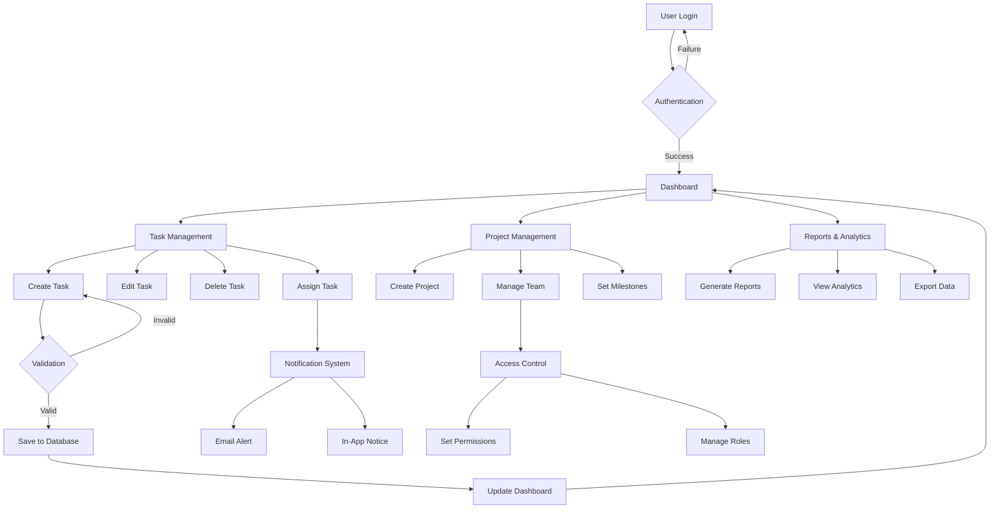
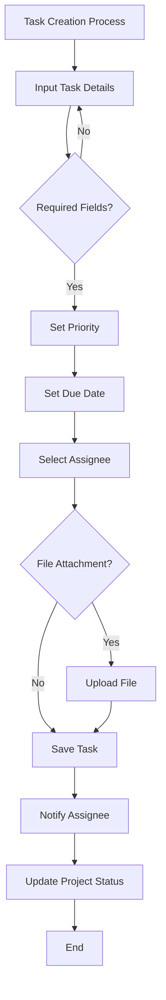
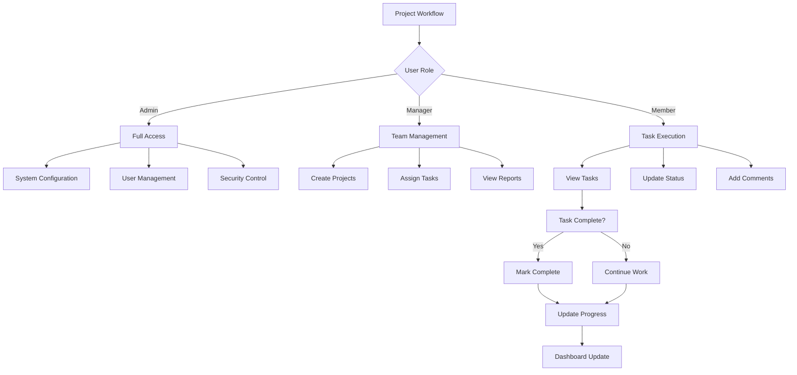
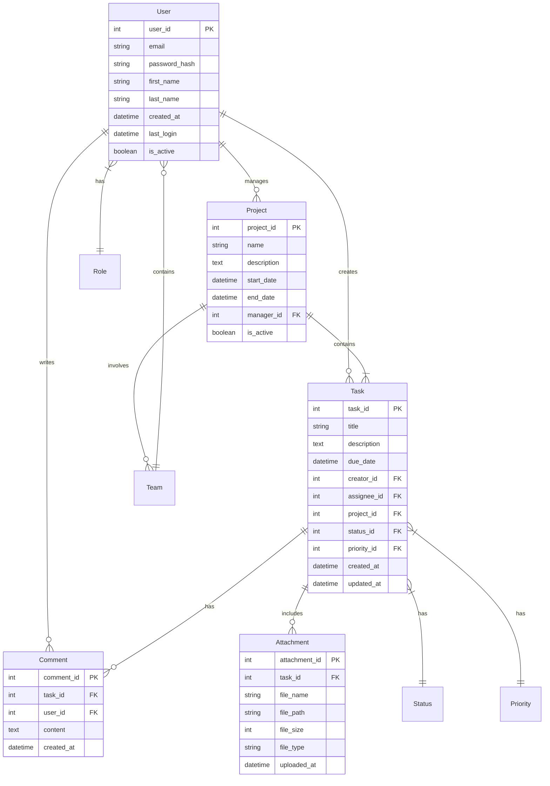
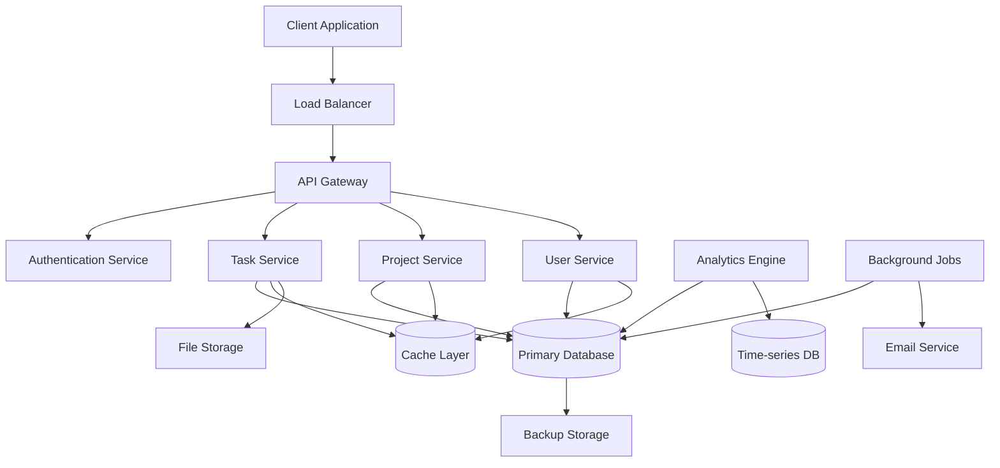

# 1. Introduction

## 1.1 Purpose

This Software Requirements Specification (SRS) document provides a comprehensive description of the Task Management System. It details the functional and non-functional requirements, system constraints, and interface specifications necessary for developers, testers, project managers, and stakeholders to successfully implement and deploy the system. This document serves as the primary reference for technical and non-technical audiences involved in the development process.

Go to next line.

## 1.2 Scope

The Task Management System is a web-based application designed to streamline task organization and team collaboration. The system encompasses:

- Task creation, assignment, and tracking capabilities
- Real-time collaboration features and notifications
- Role-based access control system
- Project categorization and organization
- Progress monitoring and reporting tools
- File attachment and sharing functionality
- Dashboard for task status visualization
- Team productivity analytics

The system will:

- Enable users to manage both personal and team tasks efficiently
- Facilitate seamless communication between team members
- Provide insights into project progress and team performance
- Support multiple user roles with different permission levels
- Integrate with existing workflow processes
- Enhance productivity through organized task management

Out of scope items include:

- Time tracking functionality
- Billing and invoicing features
- External calendar system integration
- Mobile applications (initial release)
- Video conferencing capabilities

# 2. Product Description

## 2.1 Product Perspective

The Task Management System operates as a standalone web-based application that functions within modern web browsers. The system architecture follows a client-server model where:

- Frontend interface runs in web browsers using standard web technologies
- Backend services are hosted on cloud infrastructure
- Database system maintains data persistence and integrity
- Authentication service manages user access and security
- File storage system handles document attachments
- Notification system enables real-time updates

The system interfaces with:

- Email servers for notifications
- Cloud storage for file attachments
- Authentication providers for user verification
- Database systems for data persistence

## 2.2 Product Functions

The Task Management System provides the following core functions:

| Function Category | Key Features |
| --- | --- |
| Task Management | - Create, edit, and delete tasks - Set priorities and due dates - Assign tasks to team members - Track task status and progress |
| Project Organization | - Create and manage projects - Categorize tasks within projects - Set project milestones - Monitor project timelines |
| Collaboration | - Real-time updates and notifications - Comment and discussion threads - File sharing and attachments - @mentions and team tagging |
| Access Control | - Role-based permissions - Team management - User groups and hierarchies - Access level configuration |
| Reporting | - Progress tracking dashboards - Performance analytics - Status reports - Team productivity metrics |

## 2.3 User Characteristics

The system caters to three primary user types:

1. Administrators

   - Technical expertise: High
   - System knowledge: Advanced
   - Responsibilities: System configuration, user management, security control

2. Project Managers

   - Technical expertise: Moderate
   - System knowledge: Intermediate to Advanced
   - Responsibilities: Project creation, team management, reporting

3. Team Members

   - Technical expertise: Basic to Moderate
   - System knowledge: Basic
   - Responsibilities: Task execution, collaboration, status updates

## 2.4 Constraints

### 2.4.1 Technical Constraints

- Must operate on modern web browsers (Chrome, Firefox, Safari, Edge)
- Maximum file attachment size of 25MB
- Response time under 2 seconds for standard operations
- 99.9% system availability requirement

### 2.4.2 Regulatory Constraints

- GDPR compliance for user data protection
- Data retention policies compliance
- Accessibility standards (WCAG 2.1)
- Industry-standard security protocols

### 2.4.3 Business Constraints

- Development timeline of 6 months
- Fixed budget allocation
- Limited development team size
- Initial release focused on web platform only

## 2.5 Assumptions and Dependencies

### 2.5.1 Assumptions

- Users have stable internet connectivity
- Users have access to supported web browsers
- Basic computer literacy among all users
- English as primary interface language
- Business hours aligned with primary user timezone

### 2.5.2 Dependencies

- Cloud infrastructure availability
- Third-party authentication services
- Email service providers
- Database management system
- File storage system
- Web hosting services
- SSL certificate providers

# 3. Process Flowchart

# 4. Functional Requirements

## 4.1 Task Management Features

### F1: Task Creation and Editing

**Priority: High**

| ID | Requirement Description |
| --- | --- |
| F1.1 | System shall allow users to create new tasks with title, description, due date, priority, and assignee |
| F1.2 | System shall support task editing including status updates and progress tracking |
| F1.3 | System shall enable file attachments up to 25MB per task |
| F1.4 | System shall provide task templates for recurring task types |
| F1.5 | System shall support task categorization and tagging |

### F2: Task Assignment and Tracking

**Priority: High**

| ID | Requirement Description |
| --- | --- |
| F2.1 | System shall enable task assignment to individual users or teams |
| F2.2 | System shall track task status changes and maintain change history |
| F2.3 | System shall provide real-time notifications for task updates |
| F2.4 | System shall support task dependencies and blockers |
| F2.5 | System shall enable task prioritization (Low, Medium, High, Urgent) |

## 4.2 Project Management Features

### F3: Project Organization

**Priority: High**

| ID | Requirement Description |
| --- | --- |
| F3.1 | System shall support creation of projects with customizable properties |
| F3.2 | System shall allow grouping of related tasks within projects |
| F3.3 | System shall enable project timeline visualization |
| F3.4 | System shall support project milestones and deadlines |
| F3.5 | System shall provide project templates |

### F4: Team Collaboration

**Priority: Medium**

| ID | Requirement Description |
| --- | --- |
| F4.1 | System shall provide comment threads on tasks and projects |
| F4.2 | System shall support @mentions for team member notifications |
| F4.3 | System shall enable file sharing between team members |
| F4.4 | System shall provide activity feeds for projects |
| F4.5 | System shall support team-wide announcements |

## 4.3 User Management Features

### F5: Access Control

**Priority: High**

| ID | Requirement Description |
| --- | --- |
| F5.1 | System shall support role-based access control (Admin, Manager, Member) |
| F5.2 | System shall enable custom permission sets for different user roles |
| F5.3 | System shall provide user group management |
| F5.4 | System shall maintain audit logs of permission changes |
| F5.5 | System shall support single sign-on authentication |

### F6: User Profile Management

**Priority: Medium**

| ID | Requirement Description |
| --- | --- |
| F6.1 | System shall allow users to manage their profile information |
| F6.2 | System shall enable customization of notification preferences |
| F6.3 | System shall support user availability status |
| F6.4 | System shall maintain user activity history |
| F6.5 | System shall allow password reset and account recovery |

## 4.4 Reporting and Analytics Features

### F7: Dashboard and Visualization

**Priority: Medium**

| ID | Requirement Description |
| --- | --- |
| F7.1 | System shall provide customizable dashboards |
| F7.2 | System shall display task and project progress metrics |
| F7.3 | System shall show team workload distribution |
| F7.4 | System shall generate visual reports of project status |
| F7.5 | System shall support different chart types for data visualization |

### F8: Reporting

**Priority: Low**

| ID | Requirement Description |
| --- | --- |
| F8.1 | System shall generate performance and productivity reports |
| F8.2 | System shall support custom report creation |
| F8.3 | System shall enable report scheduling and automation |
| F8.4 | System shall allow report export in multiple formats |
| F8.5 | System shall maintain report templates |

# 5. Non-Functional Requirements

## 5.1 Performance Requirements

| ID | Requirement Description | Target Metric |
| --- | --- | --- |
| P1 | Page load time | \< 2 seconds for standard operations |
| P2 | API response time | \< 500ms for 95% of requests |
| P3 | Maximum concurrent users | 10,000 users |
| P4 | Database query execution | \< 100ms for 90% of queries |
| P5 | File upload processing | \< 5 seconds for 25MB files |
| P6 | Real-time notification delivery | \< 1 second latency |
| P7 | Report generation time | \< 30 seconds for complex reports |
| P8 | Search results retrieval | \< 1 second for standard searches |

## 5.2 Safety Requirements

| ID | Requirement Description |
| --- | --- |
| S1 | Automatic data backup every 6 hours |
| S2 | Disaster recovery plan with RPO \< 1 hour |
| S3 | Failover system activation within 5 minutes |
| S4 | Transaction rollback capabilities for failed operations |
| S5 | Data corruption detection and prevention mechanisms |
| S6 | System state monitoring and health checks every minute |
| S7 | Automatic session termination after 30 minutes of inactivity |

## 5.3 Security Requirements

| ID | Requirement Description |
| --- | --- |
| SE1 | Multi-factor authentication support |
| SE2 | Data encryption at rest using AES-256 |
| SE3 | TLS 1.3 for all data in transit |
| SE4 | Password requirements: minimum 12 characters, complexity rules |
| SE5 | Role-based access control (RBAC) implementation |
| SE6 | Security audit logging of all system access |
| SE7 | Regular security vulnerability scanning |
| SE8 | API request rate limiting and throttling |
| SE9 | Cross-Site Scripting (XSS) protection |
| SE10 | SQL injection prevention measures |

## 5.4 Quality Requirements

### 5.4.1 Availability

- System uptime: 99.9% excluding planned maintenance
- Planned maintenance windows: Maximum 4 hours monthly
- Maximum unplanned downtime: 43.8 minutes/month

### 5.4.2 Maintainability

- Code documentation coverage: Minimum 80%
- Modular architecture with loose coupling
- Automated testing coverage: Minimum 85%
- Configuration changes without system restart

### 5.4.3 Usability

- Interface compliance with WCAG 2.1 Level AA
- Maximum 3 clicks to reach any feature
- Consistent UI/UX patterns across all pages
- Support for keyboard navigation
- Responsive design for all screen sizes

### 5.4.4 Scalability

- Horizontal scaling capability
- Auto-scaling based on load metrics
- Database partitioning support
- Microservices architecture ready
- Load balancing across multiple servers

### 5.4.5 Reliability

- Mean Time Between Failures (MTBF): \> 720 hours
- Mean Time To Recovery (MTTR): \< 1 hour
- Error rate: \< 0.1% of all transactions
- Data consistency check mechanisms
- Automated system health monitoring

## 5.5 Compliance Requirements

| ID | Requirement Description |
| --- | --- |
| C1 | GDPR compliance for user data protection |
| C2 | WCAG 2.1 Level AA accessibility compliance |
| C3 | SOC 2 Type II compliance for security controls |
| C4 | ISO 27001 information security standards |
| C5 | Local data protection regulations compliance |
| C6 | Regular compliance audit documentation |
| C7 | Data retention policy implementation |
| C8 | Privacy policy and terms of service maintenance |
| C9 | Cookie consent management |
| C10 | Regular compliance training for development team |

# 6. Data Requirements

## 6.1 Data Models

## 6.2 Data Storage

### 6.2.1 Storage Requirements

- Primary relational database for transactional data
- Document storage for file attachments
- In-memory cache for frequently accessed data
- Time-series database for analytics and metrics

### 6.2.2 Data Retention

| Data Type | Retention Period | Storage Location |
| --- | --- | --- |
| Active tasks | Indefinite | Primary database |
| Completed tasks | 3 years | Archive storage |
| User activity logs | 1 year | Time-series database |
| System audit logs | 2 years | Secure storage |
| File attachments | 5 years | Object storage |
| Deleted items | 30 days | Recycle bin |

### 6.2.3 Backup and Recovery

- Full database backup daily
- Incremental backups every 6 hours
- Point-in-time recovery capability
- Cross-region backup replication
- Maximum backup retention: 30 days
- Recovery Time Objective (RTO): 1 hour
- Recovery Point Objective (RPO): 6 hours

## 6.3 Data Processing

### 6.3.1 Data Flow

### 6.3.2 Data Security

| Security Layer | Implementation |
| --- | --- |
| Data at rest | AES-256 encryption |
| Data in transit | TLS 1.3 |
| Database access | Row-level security |
| API security | JWT authentication |
| File encryption | Client-side encryption |
| Key management | Hardware Security Module |

### 6.3.3 Data Processing Requirements

- Real-time task updates and notifications
- Asynchronous file processing
- Batch processing for reports
- Data validation before storage
- Data anonymization for analytics
- Automated data cleanup processes
- Rate limiting for API requests
- Concurrent transaction handling

# 7. External Interfaces

## 7.1 User Interfaces

### 7.1.1 General Requirements

| Requirement | Description |
| --- | --- |
| Responsiveness | Interface must adapt to desktop, tablet, and laptop screens (min width: 320px) |
| Color Scheme | Support light/dark themes with WCAG 2.1 compliant contrast ratios |
| Navigation | Consistent top navigation bar and left sidebar for main menu |
| Typography | System font stack with minimum 16px base size |
| Components | Material Design-based UI components |

### 7.1.2 Key Interface Elements

| Element | Requirements |
| --- | --- |
| Dashboard | - Card-based layout for task overview - Drag-and-drop task organization - Collapsible sections - Real-time status indicators |
| Task Views | - List and Kanban board views - Filterable and sortable columns - Inline editing capabilities - Progress visualization |
| Forms | - Progressive disclosure for complex inputs - Real-time validation - Autosave functionality - Keyboard navigation support |
| Notifications | - Toast messages for system alerts - Badge indicators for updates - Modal dialogs for confirmations - Notification center |

## 7.2 Software Interfaces

### 7.2.1 Database Interface

| Component | Specification |
| --- | --- |
| RDBMS | PostgreSQL 14+ |
| ORM | Prisma |
| Connection Pool | Maximum 100 connections |
| Query Timeout | 30 seconds |

### 7.2.2 External Services

| Service | Interface Type | Purpose |
| --- | --- | --- |
| AWS S3 | REST API | File storage and retrieval |
| SendGrid | SMTP/API | Email notifications |
| Auth0 | OAuth 2.0 | User authentication |
| Redis | Redis Protocol | Caching and session management |
| Elasticsearch | REST API | Full-text search capabilities |

### 7.2.3 API Specifications

| API Version | Protocol | Format | Authentication |
| --- | --- | --- | --- |
| v1 | REST | JSON | JWT Bearer |
| v1 | WebSocket | JSON | JWT Bearer |

## 7.3 Communication Interfaces

### 7.3.1 Network Protocols

| Protocol | Usage | Port |
| --- | --- | --- |
| HTTPS | Secure web traffic | 443 |
| WSS | WebSocket secure | 443 |
| SMTP | Email communication | 587 |

### 7.3.2 Data Exchange Formats

| Format | Usage |
| --- | --- |
| JSON | API responses and requests |
| JWT | Authentication tokens |
| Base64 | File encoding |
| UTF-8 | Character encoding |

### 7.3.3 Integration Points

| Integration | Protocol | Data Format | Frequency |
| --- | --- | --- | --- |
| Email Service | SMTP/API | MIME | Real-time |
| File Storage | HTTPS | Binary/Multipart | On-demand |
| Search Service | HTTPS | JSON | Real-time |
| Cache Service | TCP | Binary | Continuous |
| Authentication | HTTPS | JWT/JSON | Per session |

## 7.4 Hardware Interfaces

### 7.4.1 Client Requirements

| Component | Minimum Specification |
| --- | --- |
| CPU | 1.6 GHz dual-core |
| RAM | 4 GB |
| Display | 1280x720 resolution |
| Network | 1 Mbps broadband |
| Storage | 1 GB available space |

### 7.4.2 Server Requirements

| Component | Specification |
| --- | --- |
| CPU | 8 vCPUs |
| RAM | 16 GB |
| Storage | 500 GB SSD |
| Network | 1 Gbps |
| Backup | Redundant storage |

# 8. APPENDICES

## 8.1 Glossary

| Term | Definition |
| --- | --- |
| Assignee | User designated as responsible for completing a task |
| Blocker | A task or issue preventing progress on dependent tasks |
| Dashboard | Central interface displaying key metrics and task information |
| Kanban Board | Visual task management tool organizing items in columns by status |
| Milestone | Significant checkpoint or goal within a project timeline |
| Priority Level | Designation of task importance (Low, Medium, High, Urgent) |
| Role-Based Access | Permission system based on user roles and responsibilities |
| Sprint | Fixed time period for completing a set of tasks |
| Task Template | Predefined task structure for recurring work items |
| Workload | Amount of work assigned to a team member |

## 8.2 Acronyms

| Acronym | Definition |
| --- | --- |
| API | Application Programming Interface |
| GDPR | General Data Protection Regulation |
| JWT | JSON Web Token |
| MTBF | Mean Time Between Failures |
| MTTR | Mean Time To Recovery |
| RBAC | Role-Based Access Control |
| RPO | Recovery Point Objective |
| RTO | Recovery Time Objective |
| SRS | Software Requirements Specification |
| SSL | Secure Sockets Layer |
| TLS | Transport Layer Security |
| WCAG | Web Content Accessibility Guidelines |
| WSS | WebSocket Secure |
| XSS | Cross-Site Scripting |

## 8.3 Additional References

| Reference | Description | URL |
| --- | --- | --- |
| Material Design Guidelines | UI/UX design system specifications | https://material.io/design |
| WCAG 2.1 Documentation | Web accessibility standards | https://www.w3.org/WAI/WCAG21/Understanding/ |
| PostgreSQL Documentation | Database system reference | https://www.postgresql.org/docs/ |
| Auth0 Integration Guide | Authentication service implementation | https://auth0.com/docs/ |
| AWS S3 API Reference | File storage service documentation | https://docs.aws.amazon.com/s3/ |
| Redis Documentation | Caching system implementation | https://redis.io/documentation |
| Prisma Documentation | ORM reference and guides | https://www.prisma.io/docs/ |
| SendGrid API Documentation | Email service integration | https://docs.sendgrid.com/ |