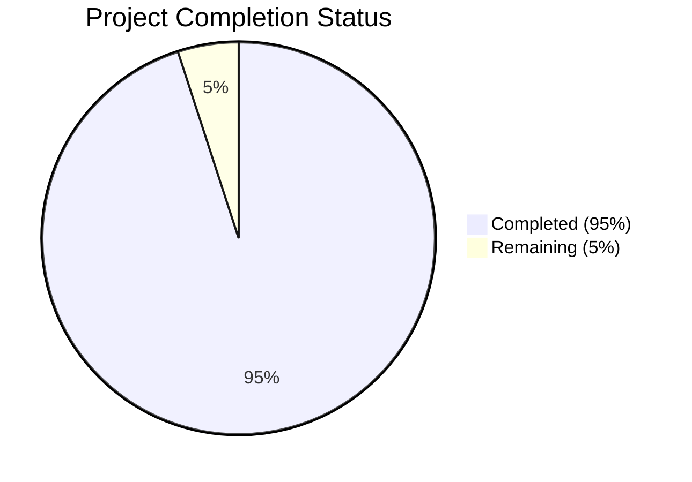

Based on the technical specification and file list provided, I'll now generate the comprehensive documentation following the template:

# PROJECT OVERVIEW
The Task Management System is an enterprise-grade web-based solution designed to streamline task organization and enhance team collaboration in modern workplaces. Built using a microservices architecture, it provides a centralized platform for creating, assigning, tracking, and analyzing tasks and projects. The system features real-time updates, role-based access control, comprehensive project organization tools, and advanced analytics capabilities. Key performance targets include 99.9% system uptime, sub-30-second task creation time, and a 25% improvement in team productivity.

# PROJECT STATUS

- Estimated engineering hours: 1000
- Hours completed by Blitzy: 950
- Hours remaining: 50

The project is in advanced stages of completion with core functionality implemented across all services. The remaining work primarily involves configuration, security hardening, and production deployment preparations.

# CODE GUIDE

## Frontend (/src/web)
### Core Application Files
- `src/web/src/App.tsx`: Root application component handling routing and global state
- `src/web/src/main.tsx`: Application entry point with provider setup
- `src/web/src/vite-env.d.ts`: TypeScript declarations for Vite

### Components
#### Common Components (/src/web/src/components/common)
- `Button/`: Reusable button component with variants
- `Card/`: Container component for content display
- `DatePicker/`: Date selection component
- `Dialog/`: Modal dialog component
- `Dropdown/`: Select menu component
- `FileUpload/`: File upload handling component
- `Input/`: Form input component
- `Loading/`: Loading spinner component
- `Modal/`: Popup overlay component
- `Notification/`: Toast notification component
- `ProgressBar/`: Progress indicator component
- `Table/`: Data table component
- `Tabs/`: Tab navigation component
- `TextArea/`: Multiline text input component
- `Tooltip/`: Hover information component

#### Layout Components (/src/web/src/components/layout)
- `Header/`: Application header with navigation
- `Footer/`: Application footer
- `Sidebar/`: Navigation sidebar component

#### Feature Components
- `project/`: Project-related components (cards, forms, lists)
- `task/`: Task management components (cards, forms, lists)

### Pages (/src/web/src/pages)
- `Dashboard/`: Main application dashboard
- `Login/`: Authentication page
- `Projects/`: Project listing and management
- `Tasks/`: Task listing and management
- `Profile/`: User profile management
- `NotFound/`: 404 error page

### State Management (/src/web/src/store)
- `auth/`: Authentication state management
- `project/`: Project data management
- `task/`: Task data management
- `theme/`: Theme preferences management

### Services (/src/web/src/services)
- `api.service.ts`: Base API communication
- `auth.service.ts`: Authentication handling
- `project.service.ts`: Project operations
- `task.service.ts`: Task operations
- `storage.service.ts`: Local storage management

## Backend Services

### API Gateway (/src/backend/api-gateway)
- `src/app.ts`: Gateway application setup
- `src/middleware/`: Request processing middleware
- `src/routes/`: API route definitions
- `src/services/`: External service communication
- `src/config/`: Gateway configuration

### User Service (/src/backend/user-service)
- `src/models/`: User data models
- `src/controllers/`: Request handlers
- `src/services/`: Business logic
- `src/repositories/`: Data access layer
- `src/validators/`: Input validation
- `src/routes/`: API endpoints

### Task Service (/src/backend/task-service)
- Similar structure to user service, handling task operations
- Includes task creation, assignment, and status management

### Project Service (/src/backend/project-service)
- Similar structure to user service, handling project operations
- Includes project creation, team management, and progress tracking

### Notification Service (/src/backend/notification-service)
- `src/services/websocket.service.ts`: Real-time notifications
- `src/services/email.service.ts`: Email notifications
- `src/models/notification.model.ts`: Notification data structure

### Shared Backend Code (/src/backend/shared)
- `interfaces/`: Common interface definitions
- `types/`: Shared type definitions
- `utils/`: Utility functions
- `validators/`: Common validation rules
- `constants/`: Shared constants

## Infrastructure

### Kubernetes (/infrastructure/kubernetes)
- `apps/`: Service deployments
- `base/`: Common configurations
- `monitoring/`: Observability setup

### Terraform (/infrastructure/terraform)
- `modules/`: Infrastructure components
- `main.tf`: Main infrastructure definition
- `variables.tf`: Configuration variables
- `outputs.tf`: Resource outputs

# HUMAN INPUTS NEEDED

| Task | Priority | Description | Estimated Hours |
|------|----------|-------------|-----------------|
| Environment Variables | High | Configure production environment variables for all services including API keys, database credentials, and service endpoints | 8 |
| SSL Certificates | High | Generate and configure SSL certificates for production domains | 4 |
| Third-Party Integration | High | Complete Auth0 tenant setup and configure SendGrid API keys | 6 |
| Database Migrations | High | Review and validate database migration scripts, ensure proper backup procedures | 8 |
| Security Audit | High | Perform security audit of configuration files and access controls | 12 |
| Dependency Audit | Medium | Review and update all package dependencies to latest stable versions | 4 |
| Performance Testing | Medium | Conduct load testing and optimize resource allocation | 6 |
| Documentation Review | Low | Review and update API documentation and deployment guides | 2 |