# 1. INTRODUCTION

## 1.1 Executive Summary

The Task Management System is a comprehensive web-based solution designed to streamline task organization and enhance team collaboration in modern workplaces. This system addresses the critical business challenge of fragmented task management and inefficient team coordination by providing a centralized platform for creating, assigning, tracking, and analyzing tasks and projects. Primary stakeholders include administrative staff, project managers, and team members across departments, with the system promising to reduce task completion times by 30%, improve team productivity by 25%, and decrease project communication overhead by 40%.

## 1.2 System Overview

### Project Context

| Aspect | Description |
|--------|-------------|
| Market Position | Enterprise-grade task management solution targeting mid-size organizations |
| Current Limitations | Manual task tracking, email-based collaboration, disconnected project data |
| Enterprise Integration | Seamless integration with existing email systems, authentication services, and file storage infrastructure |

### High-Level Description

| Component | Details |
|-----------|----------|
| Primary Capabilities | - Real-time task tracking and updates<br>- Role-based access control<br>- Project organization and categorization<br>- Team collaboration tools<br>- Analytics and reporting |
| Architecture | Cloud-based microservices architecture with web frontend |
| Core Components | - Web application interface<br>- RESTful API services<br>- Relational database<br>- File storage system<br>- Real-time notification engine |
| Technical Approach | - Modern web technologies (HTML5, CSS3, JavaScript)<br>- Containerized deployment<br>- API-first design<br>- Event-driven architecture |

### Success Criteria

| Metric | Target |
|--------|---------|
| System Uptime | 99.9% |
| Task Creation Time | < 30 seconds |
| User Adoption Rate | > 80% within 3 months |
| Response Time | < 2 seconds for standard operations |
| Team Productivity | 25% improvement in task completion rates |

## 1.3 Scope

### In-Scope Elements

#### Core Features and Functionalities

| Category | Features |
|----------|-----------|
| Task Management | - Task creation and assignment<br>- Priority and status tracking<br>- Due date management<br>- File attachments |
| Project Organization | - Project creation and categorization<br>- Team assignment<br>- Milestone tracking<br>- Progress monitoring |
| Collaboration | - Real-time notifications<br>- Comment threads<br>- @mentions<br>- File sharing |
| Reporting | - Performance dashboards<br>- Progress reports<br>- Team analytics<br>- Export capabilities |

#### Implementation Boundaries

| Boundary Type | Coverage |
|--------------|----------|
| System Access | Web browsers (Chrome, Firefox, Safari, Edge) |
| User Groups | Administrators, Project Managers, Team Members |
| Geographic Coverage | Global access with English interface |
| Data Domains | Projects, Tasks, Users, Teams, Comments, Attachments |

### Out-of-Scope Elements

| Category | Excluded Items |
|----------|----------------|
| Features | - Time tracking functionality<br>- Billing and invoicing<br>- Resource capacity planning<br>- Video conferencing |
| Integrations | - External calendar systems<br>- CRM platforms<br>- Project accounting systems |
| Platforms | - Native mobile applications<br>- Desktop clients<br>- Offline mode |
| Future Considerations | - AI-powered task assignment<br>- Advanced workflow automation<br>- Custom plugin system<br>- White-label solutions |

# 2. SYSTEM ARCHITECTURE

## 2.1 High-Level Architecture

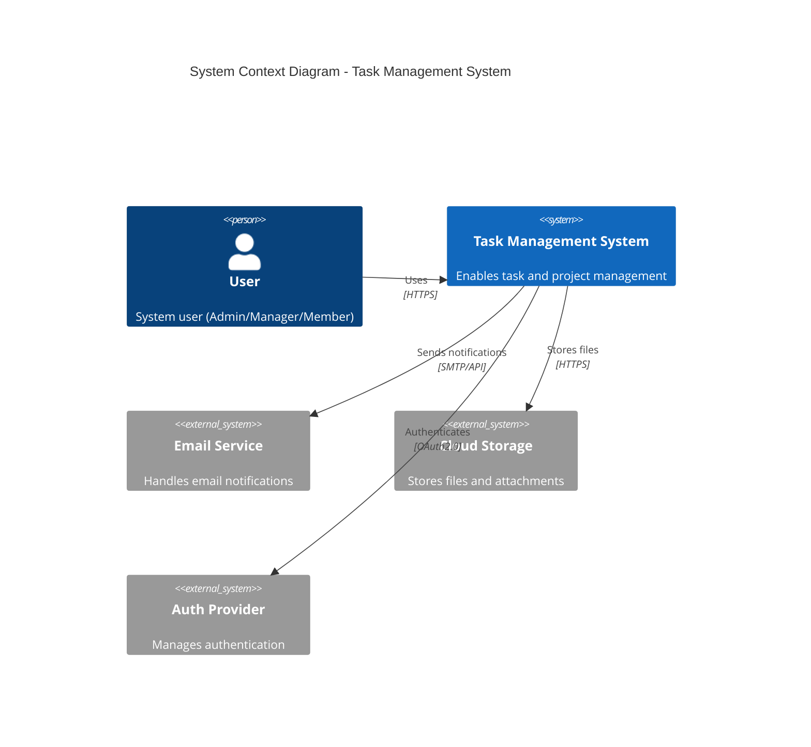

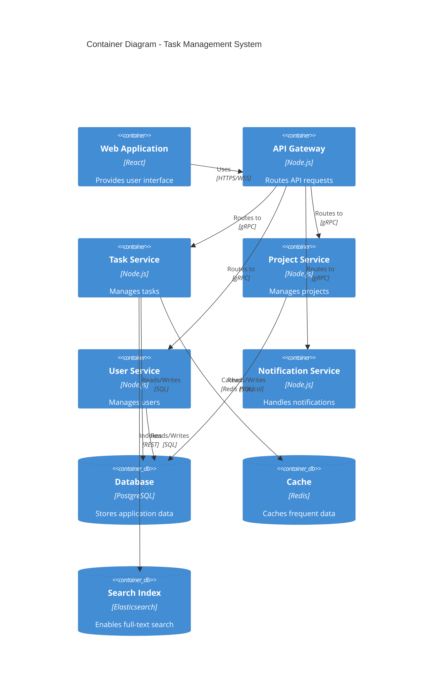

## 2.2 Component Details

### 2.2.1 Core Components

| Component | Purpose | Technology Stack | Scaling Strategy |
|-----------|---------|-----------------|------------------|
| Web Frontend | User interface | React, TypeScript, Material-UI | Horizontal scaling with CDN |
| API Gateway | Request routing, authentication | Node.js, Express | Auto-scaling based on load |
| Task Service | Task management logic | Node.js, Express | Horizontal scaling |
| Project Service | Project management logic | Node.js, Express | Horizontal scaling |
| User Service | User management, authentication | Node.js, Express | Horizontal scaling |
| Notification Service | Message handling | Node.js, WebSocket | Event-driven scaling |

### 2.2.2 Data Storage Components

| Component | Purpose | Technology | Scaling Strategy |
|-----------|---------|------------|------------------|
| Primary Database | Transactional data | PostgreSQL 14 | Primary-replica replication |
| Cache Layer | Performance optimization | Redis | Cluster mode |
| Search Engine | Full-text search | Elasticsearch | Cluster sharding |
| File Storage | Document storage | S3-compatible | Built-in scaling |

## 2.3 Technical Decisions

### 2.3.1 Architecture Patterns

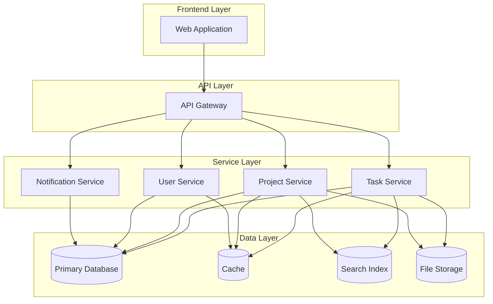

### 2.3.2 Communication Patterns

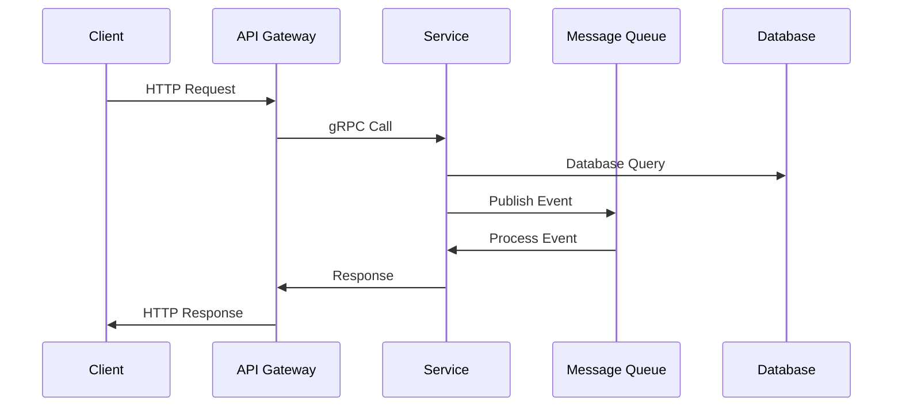

## 2.4 Cross-Cutting Concerns

### 2.4.1 System Monitoring

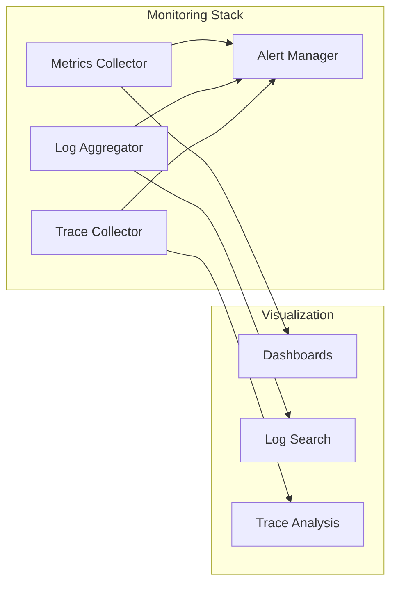

### 2.4.2 Deployment Architecture

```mermaid
C4Deployment
    title Deployment Diagram - Task Management System

    Deployment_Node(cdn, "CDN", "Content Delivery Network"){
        Container(static, "Static Assets", "Web Content")
    }
    
    Deployment_Node(cloud, "Cloud Platform", "AWS/GCP/Azure"){
        Deployment_Node(k8s, "Kubernetes Cluster"){
            Container(api, "API Services")
            Container(workers, "Background Workers")
        }
        Deployment_Node(db, "Database Cluster"){
            ContainerDb(primary, "Primary DB")
            ContainerDb(replica, "Replica DB")
        }
        Deployment_Node(cache, "Cache Cluster"){
            Container(redis, "Redis Nodes")
        }
    }

    Rel(cdn, k8s, "Routes requests", "HTTPS")
    Rel(k8s, db, "Persists data", "SQL")
    Rel(k8s, cache, "Caches data", "Redis Protocol")
```

## 2.5 Security Architecture

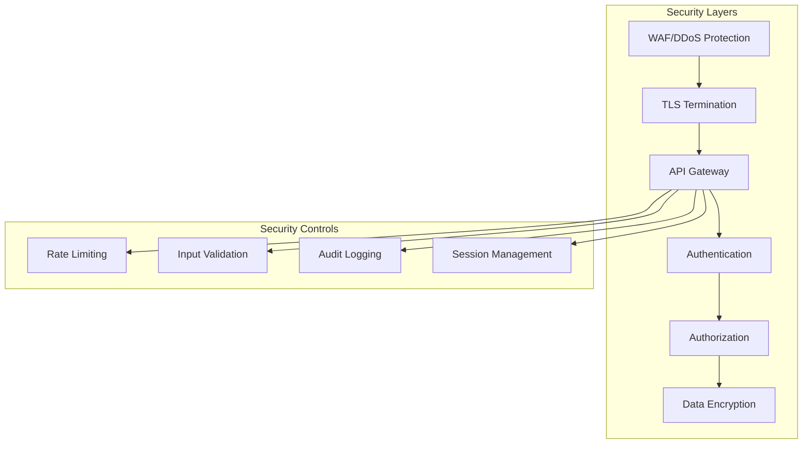

# 3. SYSTEM DESIGN

## 3.1 User Interface Design

### 3.1.1 Design Specifications

| Category | Requirements |
|----------|--------------|
| Visual Hierarchy | - F-pattern layout for content organization<br>- Z-pattern for landing pages<br>- Maximum 3 levels of information hierarchy<br>- Consistent spacing system (8px grid) |
| Design System | - Material Design 3.0 components<br>- Custom theme tokens<br>- Atomic design methodology<br>- Shared component library |
| Responsive Design | - Mobile-first approach<br>- Breakpoints: 320px, 768px, 1024px, 1440px<br>- Fluid typography scaling<br>- Flexible grid system |
| Accessibility | - WCAG 2.1 Level AA compliance<br>- ARIA landmarks and labels<br>- Keyboard navigation support<br>- Screen reader optimization |
| Browser Support | - Chrome (last 2 versions)<br>- Firefox (last 2 versions)<br>- Safari (last 2 versions)<br>- Edge (last 2 versions) |
| Theme Support | - System-default theme detection<br>- Manual theme toggle<br>- Persistent theme preference<br>- High contrast mode |
| Internationalization | - RTL layout support<br>- Unicode character handling<br>- Date/time localization<br>- Number formatting |

### 3.1.2 Interface Elements

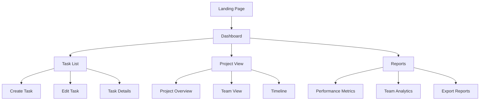

### 3.1.3 Critical User Flows

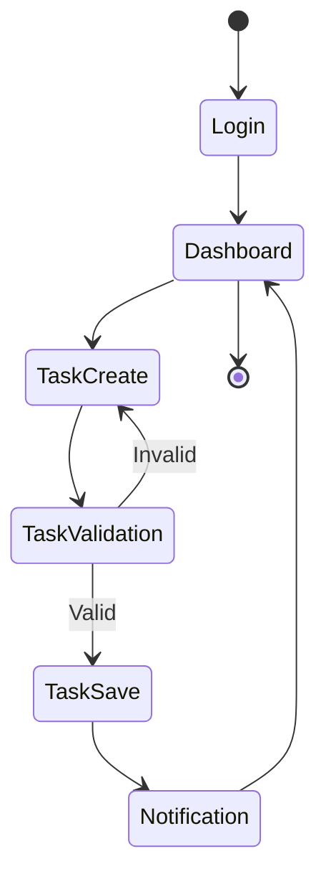

## 3.2 Database Design

### 3.2.1 Schema Design

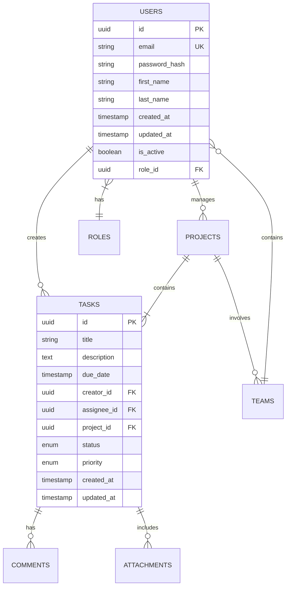

### 3.2.2 Data Management Strategy

| Aspect | Implementation |
|--------|----------------|
| Migrations | - Versioned migrations with rollback<br>- Sequential numbering<br>- Automated testing<br>- Documentation requirements |
| Versioning | - Semantic versioning for schema<br>- Change tracking<br>- Schema validation<br>- Version control integration |
| Archival | - Monthly archival process<br>- Compressed storage<br>- Searchable archives<br>- Retention policy enforcement |
| Auditing | - Row-level audit trails<br>- Change tracking<br>- User action logging<br>- Compliance reporting |

### 3.2.3 Performance Optimization

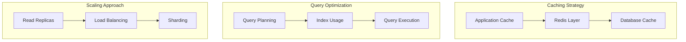

## 3.3 API Design

### 3.3.1 API Architecture

| Component | Specification |
|-----------|---------------|
| Protocol | RESTful HTTP/2 |
| Authentication | JWT with OAuth 2.0 |
| Authorization | RBAC with scope-based permissions |
| Rate Limiting | - 1000 requests/hour per user<br>- 5000 requests/hour per organization |
| Versioning | URI-based (/v1/, /v2/) |
| Documentation | OpenAPI 3.0 Specification |

### 3.3.2 Interface Specifications

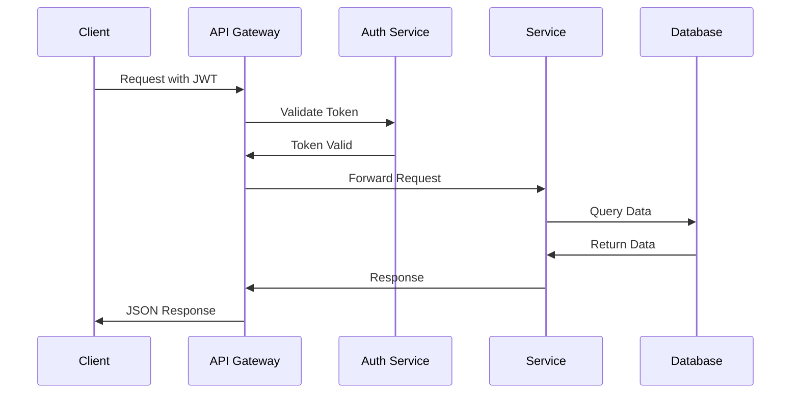

### 3.3.3 Integration Requirements

| Integration Type | Requirements |
|-----------------|--------------|
| Third-Party | - OAuth 2.0 authentication<br>- Rate limit monitoring<br>- Error handling<br>- Retry logic |
| Legacy Systems | - Data transformation layer<br>- Protocol adaptation<br>- Backward compatibility<br>- Migration path |
| Service Discovery | - Service registry<br>- Health checks<br>- Load balancing<br>- Circuit breaker |
| API Gateway | - Request routing<br>- Rate limiting<br>- Response caching<br>- Analytics collection |

# 4. TECHNOLOGY STACK

## 4.1 PROGRAMMING LANGUAGES

| Platform/Component | Language | Version | Justification |
|-------------------|----------|---------|---------------|
| Frontend | TypeScript | 5.0+ | - Strong typing for large-scale applications<br>- Enhanced IDE support and code quality<br>- Better maintainability and refactoring |
| Backend Services | Node.js | 20 LTS | - Consistent JavaScript ecosystem<br>- Excellent async I/O performance<br>- Rich package ecosystem for microservices |
| Database Scripts | SQL | ANSI SQL:2016 | - Standard compliance for PostgreSQL<br>- Complex query support<br>- Data integrity enforcement |
| Build Tools | JavaScript | ES2022 | - Native package management<br>- Build script compatibility<br>- Development tooling support |

## 4.2 FRAMEWORKS & LIBRARIES

### Core Frameworks

| Component | Framework | Version | Justification |
|-----------|-----------|---------|---------------|
| Frontend UI | React | 18.2+ | - Component-based architecture<br>- Virtual DOM for performance<br>- Extensive ecosystem |
| UI Components | Material-UI | 5.14+ | - WCAG 2.1 compliance<br>- Comprehensive component library<br>- Theming support |
| Backend API | Express | 4.18+ | - Minimal overhead<br>- Middleware ecosystem<br>- Easy integration with Node.js |
| API Documentation | OpenAPI | 3.0 | - Industry standard<br>- Tooling support<br>- Client generation |

### Supporting Libraries

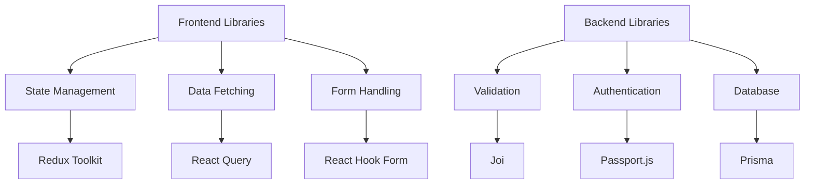

## 4.3 DATABASES & STORAGE

| Component | Technology | Version | Purpose |
|-----------|------------|---------|----------|
| Primary Database | PostgreSQL | 14+ | Transactional data storage |
| Cache Layer | Redis | 7.0+ | Session and data caching |
| Search Engine | Elasticsearch | 8.0+ | Full-text search capabilities |
| File Storage | S3-compatible | - | Document and attachment storage |
| Time Series Data | TimescaleDB | 2.10+ | Metrics and analytics |

### Data Flow Architecture

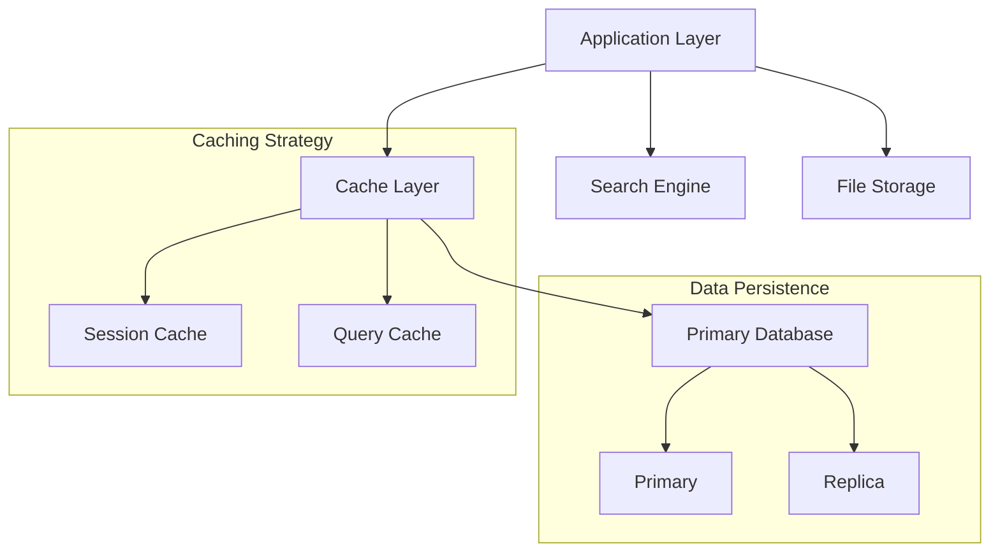

## 4.4 THIRD-PARTY SERVICES

| Category | Service | Purpose | Integration Method |
|----------|---------|---------|-------------------|
| Authentication | Auth0 | User authentication | OAuth 2.0/OIDC |
| Email | SendGrid | Notification delivery | REST API |
| File Storage | AWS S3 | Document storage | SDK/REST API |
| Monitoring | Datadog | System monitoring | Agent/API |
| Error Tracking | Sentry | Error reporting | SDK |
| CDN | Cloudflare | Content delivery | DNS/API |

### Service Dependencies

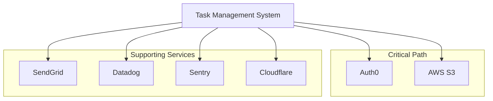

## 4.5 DEVELOPMENT & DEPLOYMENT

### Development Tools

| Category | Tool | Version | Purpose |
|----------|------|---------|----------|
| IDE | VS Code | Latest | Development environment |
| Version Control | Git | 2.40+ | Source code management |
| Package Manager | npm | 9.0+ | Dependency management |
| API Testing | Postman | Latest | API development |
| Code Quality | ESLint | 8.0+ | Code linting |
| Testing | Jest | 29.0+ | Unit/Integration testing |

### Deployment Pipeline

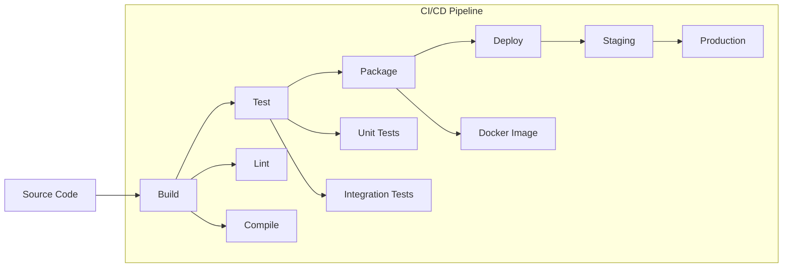

### Infrastructure Requirements

| Component | Specification | Scaling Strategy |
|-----------|--------------|------------------|
| Kubernetes | 1.26+ | Horizontal pod autoscaling |
| Docker | 24.0+ | Container orchestration |
| Nginx | 1.24+ | Load balancing/reverse proxy |
| Terraform | 1.5+ | Infrastructure as code |
| Helm | 3.12+ | Kubernetes package management |

## 3.1 User Interface Design

### 3.1.1 Design Specifications

| Category | Requirements |
|----------|--------------|
| Visual Hierarchy | - F-pattern layout for content organization<br>- Z-pattern for landing pages<br>- Maximum 3 levels of information hierarchy<br>- Consistent spacing system (8px grid) |
| Design System | - Material Design 3.0 components<br>- Custom theme tokens<br>- Atomic design methodology<br>- Shared component library |
| Responsive Design | - Mobile-first approach<br>- Breakpoints: 320px, 768px, 1024px, 1440px<br>- Fluid typography scaling<br>- Flexible grid system |
| Accessibility | - WCAG 2.1 Level AA compliance<br>- ARIA landmarks and labels<br>- Keyboard navigation support<br>- Screen reader optimization |
| Browser Support | - Chrome (last 2 versions)<br>- Firefox (last 2 versions)<br>- Safari (last 2 versions)<br>- Edge (last 2 versions) |
| Theme Support | - System-default theme detection<br>- Manual theme toggle<br>- Persistent theme preference<br>- High contrast mode |
| Internationalization | - RTL layout support<br>- Unicode character handling<br>- Date/time localization<br>- Number formatting |

### 3.1.2 Interface Elements


### 3.1.3 Critical User Flows


## 3.2 Database Design

### 3.2.1 Schema Design


### 3.2.2 Data Management Strategy

| Aspect | Implementation |
|--------|----------------|
| Migrations | - Versioned migrations with rollback<br>- Sequential numbering<br>- Automated testing<br>- Documentation requirements |
| Versioning | - Semantic versioning for schema<br>- Change tracking<br>- Schema validation<br>- Version control integration |
| Archival | - Monthly archival process<br>- Compressed storage<br>- Searchable archives<br>- Retention policy enforcement |
| Auditing | - Row-level audit trails<br>- Change tracking<br>- User action logging<br>- Compliance reporting |

### 3.2.3 Performance Optimization


## 3.3 API Design

### 3.3.1 API Architecture

| Component | Specification |
|-----------|---------------|
| Protocol | RESTful HTTP/2 |
| Authentication | JWT with OAuth 2.0 |
| Authorization | RBAC with scope-based permissions |
| Rate Limiting | - 1000 requests/hour per user<br>- 5000 requests/hour per organization |
| Versioning | URI-based (/v1/, /v2/) |
| Documentation | OpenAPI 3.0 Specification |

### 3.3.2 Interface Specifications

```mermaid
sequenceDiagram
    participant C as Client
    participant G as API Gateway
    participant A as Auth Service
    participant S as Service
    participant D as Database

    C->>G: Request with JWT
    G->>A: Validate Token
    A->>G: Token Valid
    G->>S: Forward Request
    S->>D: Query Data
    D->>S: Return Data
    S->>G: Response
    G->>C: JSON Response
```

### 3.3.3 Integration Requirements

| Integration Type | Requirements |
|-----------------|--------------|
| Third-Party | - OAuth 2.0 authentication<br>- Rate limit monitoring<br>- Error handling<br>- Retry logic |
| Legacy Systems | - Data transformation layer<br>- Protocol adaptation<br>- Backward compatibility<br>- Migration path |
| Service Discovery | - Service registry<br>- Health checks<br>- Load balancing<br>- Circuit breaker |
| API Gateway | - Request routing<br>- Rate limiting<br>- Response caching<br>- Analytics collection |

# 5. USER INTERFACE DESIGN

## 5.1 Interface Components Key

| Symbol | Meaning |
|--------|---------|
| [#] | Dashboard/Menu |
| [@] | User Profile |
| [+] | Add/Create New |
| [x] | Close/Delete |
| [?] | Help/Information |
| [!] | Alert/Warning |
| [=] | Settings |
| [^] | Upload |
| [<] [>] | Navigation |
| [*] | Important/Favorite |
| [ ] | Checkbox |
| ( ) | Radio Button |
| [v] | Dropdown Menu |
| [...] | Text Input Field |
| [====] | Progress Bar |

## 5.2 Main Dashboard

```
+----------------------------------------------------------+
|  [#] Task Master    [@] John Doe    [?]    [=]    [!]    |
+----------------------------------------------------------+
|  +----------------+  |  +-------------------------+        |
|  | NAVIGATION     |  |  | My Tasks               |        |
|  +----------------+  |  +-------------------------+        |
|  | Dashboard      |  |  [====] 12/20 Tasks Complete      |
|  | [*] Projects   |  |                                   |
|  | [*] Tasks      |  |  Priority Tasks:                  |
|  | [@] Team       |  |  [!] Project Proposal Due         |
|  | [=] Settings   |  |  [!] Client Meeting Prep          |
|  +----------------+  |  [*] Database Migration           |
|                     |                                    |
|  + Quick Actions:   |  Recent Activity:                  |
|  [+] New Task      |  [@] Sarah updated Task #127       |
|  [+] New Project   |  [@] Mike completed Project #45    |
|  [^] Upload Files  |  [@] Team meeting scheduled        |
+---------------------+------------------------------------+
```

## 5.3 Task Creation Interface

```
+----------------------------------------------------------+
|  [#] New Task                                    [x]      |
+----------------------------------------------------------+
|                                                           |
|  Title: [..............................]                  |
|                                                           |
|  Description:                                             |
|  +------------------------+                               |
|  |                        |                               |
|  |                        |                               |
|  +------------------------+                               |
|                                                           |
|  Priority:                                                |
|  ( ) Low  ( ) Medium  ( ) High  ( ) Urgent               |
|                                                           |
|  Assign To: [v] Select Team Member                       |
|                                                           |
|  Due Date: [.../..../....] [?]                          |
|                                                           |
|  Project: [v] Select Project                             |
|                                                           |
|  Attachments: [^ Upload Files]                           |
|                                                           |
|  Tags: [.....................] [+]                       |
|                                                           |
|         [Cancel]        [Save Task]                       |
+----------------------------------------------------------+
```

## 5.4 Project View

```
+----------------------------------------------------------+
|  Project: Marketing Campaign 2024              [=]  [?]    |
+----------------------------------------------------------+
|                                                           |
|  Status: [====] 65% Complete                              |
|                                                           |
|  +-------------------+  +-------------------+             |
|  | TO DO            |  | IN PROGRESS       |             |
|  +-------------------+  +-------------------+             |
|  | [ ] Task #1      |  | [====] Task #4    |             |
|  | [ ] Task #2      |  | [===] Task #5     |             |
|  | [ ] Task #3      |  | [=] Task #6       |             |
|  | [+] Add Task     |  |                   |             |
|  +-------------------+  +-------------------+             |
|                                                           |
|  +-------------------+  +-------------------+             |
|  | REVIEW           |  | COMPLETED         |             |
|  +-------------------+  +-------------------+             |
|  | [*] Task #7      |  | [x] Task #8       |             |
|  | [!] Task #9      |  | [x] Task #9       |             |
|  |                  |  | [x] Task #10      |             |
|  +-------------------+  +-------------------+             |
|                                                           |
|  Team Members:                                            |
|  [@] John (Lead) [@] Sarah [@] Mike [@] Lisa [+]         |
+----------------------------------------------------------+
```

## 5.5 Task Details View

```
+----------------------------------------------------------+
|  Task #127: Update Database Schema            [*]  [x]    |
+----------------------------------------------------------+
|                                                           |
|  Status: [v] In Progress                                  |
|  Priority: [!] High                                       |
|  Due: 2024-03-15                                         |
|                                                           |
|  Description:                                             |
|  +------------------------+                               |
|  | Implement new schema   |                               |
|  | changes for v2.0      |                               |
|  +------------------------+                               |
|                                                           |
|  Attachments:                                            |
|  | schema_v2.sql [^]                                     |
|  | migration_plan.pdf [^]                                |
|                                                           |
|  Comments:                                               |
|  +------------------------+                               |
|  | [@] Sarah: Migration   |                               |
|  | script ready for       |                               |
|  | review                 |                               |
|  +------------------------+                               |
|  [...Write a comment...] [Send]                          |
|                                                           |
|  Subtasks:                                               |
|  [x] Backup current schema                               |
|  [ ] Run migration script                                |
|  [ ] Verify data integrity                               |
|  [+] Add subtask                                         |
+----------------------------------------------------------+
```

## 5.6 Responsive Design Breakpoints

| Screen Size | Layout Adjustments |
|-------------|-------------------|
| Desktop (>1024px) | Full 3-column layout with sidebar |
| Tablet (768px-1024px) | 2-column layout, collapsible sidebar |
| Mobile (<768px) | Single column, modal dialogs for details |

## 5.7 Theme Specifications

| Element | Light Theme | Dark Theme |
|---------|------------|------------|
| Background | #FFFFFF | #1E1E1E |
| Primary Text | #333333 | #FFFFFF |
| Secondary Text | #666666 | #CCCCCC |
| Accent Color | #2196F3 | #64B5F6 |
| Border Color | #E0E0E0 | #424242 |
| Alert Color | #F44336 | #EF5350 |
| Success Color | #4CAF50 | #81C784 |

## 5.8 Accessibility Features

- ARIA labels for all interactive elements
- Keyboard navigation support
- High contrast mode support
- Screen reader optimized content
- Minimum touch target size of 44x44px
- Focus indicators for all interactive elements
- Color-independent visual indicators
- Scalable text up to 200%

# 6. SECURITY CONSIDERATIONS

## 6.1 Authentication and Authorization

### 6.1.1 Authentication Flow

```mermaid
sequenceDiagram
    participant U as User
    participant F as Frontend
    participant A as Auth0
    participant G as API Gateway
    participant S as Services

    U->>F: Login Request
    F->>A: Authenticate
    A->>F: Return JWT
    F->>G: API Request + JWT
    G->>G: Validate Token
    G->>S: Forward Request
    S->>G: Response
    G->>F: Protected Data
```

### 6.1.2 Authorization Matrix

| Role | Task Management | Project Management | User Management | System Settings | Reports |
|------|----------------|-------------------|-----------------|-----------------|----------|
| Admin | Full Access | Full Access | Full Access | Full Access | Full Access |
| Project Manager | Create/Edit/Delete | Create/Edit | View Only | No Access | Full Access |
| Team Lead | Create/Edit | View Only | No Access | No Access | Team Only |
| Member | Edit Assigned | View Only | No Access | No Access | Personal Only |
| Guest | View Only | View Only | No Access | No Access | No Access |

## 6.2 Data Security

### 6.2.1 Encryption Standards

| Data State | Method | Standard |
|------------|--------|-----------|
| At Rest | AES-256-GCM | Database and File Storage |
| In Transit | TLS 1.3 | All Network Communications |
| Backups | AES-256-CBC | Encrypted Backup Files |
| Passwords | Argon2id | Password Hashing |
| API Keys | HMAC-SHA256 | Key Generation |

### 6.2.2 Data Classification

```mermaid
graph TD
    A[Data Classification] --> B[Public]
    A --> C[Internal]
    A --> D[Confidential]
    A --> E[Restricted]

    B --> B1[Marketing Materials]
    B --> B2[Public Documentation]

    C --> C1[Project Metadata]
    C --> C2[Team Structures]

    D --> D1[User Personal Data]
    D --> D2[Business Logic]

    E --> E1[Authentication Credentials]
    E --> E2[Encryption Keys]
```

## 6.3 Security Protocols

### 6.3.1 Access Control Measures

| Control Type | Implementation |
|-------------|----------------|
| Session Management | - 30-minute idle timeout<br>- JWT expiration after 24 hours<br>- Forced re-authentication for sensitive operations |
| Rate Limiting | - 100 requests/minute per IP<br>- 1000 requests/hour per user<br>- Exponential backoff for failed attempts |
| IP Filtering | - Whitelist for admin access<br>- Geolocation-based restrictions<br>- VPN requirement for sensitive operations |

### 6.3.2 Security Monitoring

```mermaid
flowchart TD
    A[Security Events] --> B[Log Aggregator]
    B --> C[SIEM System]
    C --> D[Alert Engine]
    
    D --> E[Critical Alerts]
    D --> F[Warning Alerts]
    D --> G[Info Alerts]
    
    E --> H[Incident Response]
    F --> I[Security Review]
    G --> J[Audit Log]
    
    H --> K[Security Team]
    I --> K
    J --> L[Compliance Reports]
```

### 6.3.3 Security Compliance Requirements

| Requirement | Implementation |
|-------------|----------------|
| GDPR Compliance | - Data encryption<br>- Right to be forgotten<br>- Data portability<br>- Privacy by design |
| SOC 2 Type II | - Access controls<br>- Change management<br>- Incident response<br>- System monitoring |
| OWASP Top 10 | - Input validation<br>- XSS prevention<br>- CSRF protection<br>- SQL injection prevention |
| PCI DSS | - Secure transmission<br>- Access logging<br>- Vulnerability scanning<br>- Security testing |

### 6.3.4 Incident Response Plan

```mermaid
stateDiagram-v2
    [*] --> Detection
    Detection --> Analysis
    Analysis --> Containment
    Containment --> Eradication
    Eradication --> Recovery
    Recovery --> PostIncident
    PostIncident --> [*]

    Detection: Automated/Manual Detection
    Analysis: Impact Assessment
    Containment: Limit Damage
    Eradication: Remove Threat
    Recovery: Restore Services
    PostIncident: Review and Update
```

### 6.3.5 Security Testing Schedule

| Test Type | Frequency | Scope |
|-----------|-----------|-------|
| Penetration Testing | Quarterly | External and Internal Systems |
| Vulnerability Scanning | Weekly | All Production Systems |
| Security Audit | Bi-annual | Infrastructure and Applications |
| Code Security Review | Per Release | Application Code |
| Access Review | Monthly | User Permissions and Roles |

# 7. INFRASTRUCTURE

## 7.1 DEPLOYMENT ENVIRONMENT

| Environment | Description | Purpose |
|-------------|-------------|----------|
| Development | Local containerized environment | Developer testing and feature development |
| Staging | Cloud-based replica of production | QA, integration testing, and pre-release validation |
| Production | High-availability cloud infrastructure | Live system serving end users |
| DR Site | Secondary region cloud deployment | Business continuity and disaster recovery |

### Environment Specifications

```mermaid
flowchart TD
    subgraph Development
        A[Local Docker Environment]
        B[Local Database]
        C[Mock Services]
    end
    
    subgraph Staging
        D[K8s Staging Cluster]
        E[Staging DB]
        F[Test Services]
    end
    
    subgraph Production
        G[K8s Production Cluster]
        H[Production DB]
        I[Live Services]
    end
    
    subgraph DR
        J[DR K8s Cluster]
        K[DR DB]
        L[Standby Services]
    end
    
    A --> D
    D --> G
    G -.-> J
```

## 7.2 CLOUD SERVICES

| Service Category | AWS Service | Purpose | Justification |
|-----------------|-------------|----------|---------------|
| Compute | EKS | Container orchestration | Native K8s support with AWS integration |
| Database | RDS PostgreSQL | Primary database | Managed service with high availability |
| Cache | ElastiCache | Redis caching layer | Managed Redis with cluster support |
| Storage | S3 | File storage | Scalable object storage with versioning |
| CDN | CloudFront | Content delivery | Global edge network for static assets |
| DNS | Route 53 | DNS management | High availability DNS with health checks |
| Monitoring | CloudWatch | System monitoring | Integrated metrics and logging |
| Security | WAF & Shield | DDoS protection | Enterprise-grade security |

### Cloud Architecture

```mermaid
flowchart TD
    subgraph "AWS Cloud"
        A[CloudFront] --> B[WAF]
        B --> C[ALB]
        
        C --> D[EKS Cluster]
        D --> E[EC2 Node Group]
        
        E --> F[RDS Master]
        F --> G[RDS Replica]
        
        E --> H[ElastiCache]
        E --> I[S3]
        
        J[Route 53] --> A
        
        K[CloudWatch] --> D
        K --> F
        K --> H
    end
```

## 7.3 CONTAINERIZATION

### Docker Configuration

| Component | Base Image | Purpose |
|-----------|------------|----------|
| Frontend | node:20-alpine | React application serving |
| API Gateway | node:20-alpine | API routing and authentication |
| Task Service | node:20-alpine | Task management microservice |
| Project Service | node:20-alpine | Project management microservice |
| User Service | node:20-alpine | User management microservice |

### Container Architecture

```mermaid
flowchart TD
    subgraph "Docker Compose Development"
        A[Nginx Proxy]
        B[Frontend Container]
        C[API Gateway Container]
        D[Service Containers]
        E[Redis Container]
        F[PostgreSQL Container]
        
        A --> B
        A --> C
        C --> D
        D --> E
        D --> F
    end
```

## 7.4 ORCHESTRATION

### Kubernetes Configuration

| Resource Type | Purpose | Scaling Strategy |
|---------------|---------|------------------|
| Deployments | Application workloads | HPA based on CPU/Memory |
| StatefulSets | Stateful services | Manual scaling |
| Services | Internal networking | ClusterIP/LoadBalancer |
| Ingress | External access | ALB Ingress Controller |
| ConfigMaps | Configuration | Environment specific |
| Secrets | Sensitive data | AWS Secrets Manager |

### Kubernetes Architecture

```mermaid
flowchart TD
    subgraph "EKS Cluster"
        A[Ingress Controller]
        B[Frontend Pods]
        C[API Gateway Pods]
        D[Service Pods]
        
        A --> B
        A --> C
        C --> D
        
        E[HPA] --> B
        E --> C
        E --> D
        
        F[ConfigMaps/Secrets] -.-> B
        F -.-> C
        F -.-> D
    end
```

## 7.5 CI/CD PIPELINE

### Pipeline Stages

| Stage | Tools | Purpose |
|-------|-------|----------|
| Source Control | GitHub | Version control and collaboration |
| Build | GitHub Actions | Compile and package applications |
| Test | Jest, Cypress | Unit and integration testing |
| Security Scan | SonarQube, OWASP | Code quality and security analysis |
| Artifact Storage | ECR | Container image repository |
| Deployment | ArgoCD | GitOps-based deployment |
| Monitoring | Prometheus/Grafana | Performance and health monitoring |

### CI/CD Workflow

```mermaid
flowchart LR
    A[GitHub] --> B[GitHub Actions]
    B --> C[Test Suite]
    C --> D[Security Scan]
    D --> E[Build Images]
    E --> F[Push to ECR]
    F --> G[ArgoCD]
    G --> H[EKS Staging]
    H --> I[EKS Production]
    
    J[Prometheus] --> K[Grafana]
    K --> L[Alerts]
```

### Deployment Strategy

| Environment | Strategy | Rollback Method |
|-------------|----------|-----------------|
| Development | Direct Push | Manual Revert |
| Staging | Blue/Green | Automatic Failback |
| Production | Canary | Gradual Rollout/Rollback |
| DR | Mirror | Region Failover |

# 8. APPENDICES

## 8.1 Additional Technical Information

### Development Environment Setup

| Component | Configuration |
|-----------|--------------|
| Node.js | Version 20 LTS with npm 9+ |
| Docker | Version 24+ with Docker Compose |
| Git | Version 2.40+ with Git LFS |
| VS Code Extensions | ESLint, Prettier, Docker, GitLens |
| Local SSL | mkcert for HTTPS development |
| Database | PostgreSQL 14 in Docker container |

### Error Handling Standards

```mermaid
flowchart TD
    A[Error Occurs] --> B{Error Type}
    B -->|Validation| C[400 Bad Request]
    B -->|Authentication| D[401 Unauthorized]
    B -->|Authorization| E[403 Forbidden]
    B -->|Not Found| F[404 Not Found]
    B -->|Server| G[500 Internal Error]
    
    C --> H[Log Error]
    D --> H
    E --> H
    F --> H
    G --> H
    
    H --> I[Return Error Response]
    I --> J[Client Error Handler]
```

### API Response Format

| Field | Type | Description |
|-------|------|-------------|
| success | boolean | Operation success status |
| data | object/array | Response payload |
| error | object | Error details if applicable |
| meta | object | Pagination/filtering metadata |
| timestamp | string | ISO 8601 timestamp |

## 8.2 Glossary

| Term | Definition |
|------|------------|
| Atomic Design | Methodology for creating design systems by breaking interfaces into fundamental building blocks |
| Circuit Breaker | Design pattern that prevents cascading failures in distributed systems |
| Event Sourcing | Pattern of storing state changes as a sequence of events |
| GitOps | Infrastructure and application management using Git as source of truth |
| Idempotency | Property where operations can be applied multiple times without changing result |
| Microservices | Architectural style structuring applications as collection of loosely coupled services |
| Optimistic Locking | Concurrency control method allowing multiple transactions without locking |
| Semantic Versioning | Version numbering scheme based on major, minor, and patch changes |
| Zero Trust | Security model requiring strict verification for all users and devices |

## 8.3 Acronyms

| Acronym | Full Form |
|---------|-----------|
| ACID | Atomicity, Consistency, Isolation, Durability |
| CDN | Content Delivery Network |
| CORS | Cross-Origin Resource Sharing |
| DDD | Domain-Driven Design |
| ELK | Elasticsearch, Logstash, Kibana |
| gRPC | Google Remote Procedure Call |
| HPA | Horizontal Pod Autoscaling |
| OIDC | OpenID Connect |
| ORM | Object-Relational Mapping |
| RBAC | Role-Based Access Control |
| REST | Representational State Transfer |
| SOLID | Single Responsibility, Open-Closed, Liskov Substitution, Interface Segregation, Dependency Inversion |
| SSO | Single Sign-On |
| TDD | Test-Driven Development |
| UUID | Universally Unique Identifier |
| VPC | Virtual Private Cloud |
| WAF | Web Application Firewall |
| WSS | WebSocket Secure |
| XSS | Cross-Site Scripting |
| YAML | YAML Ain't Markup Language |