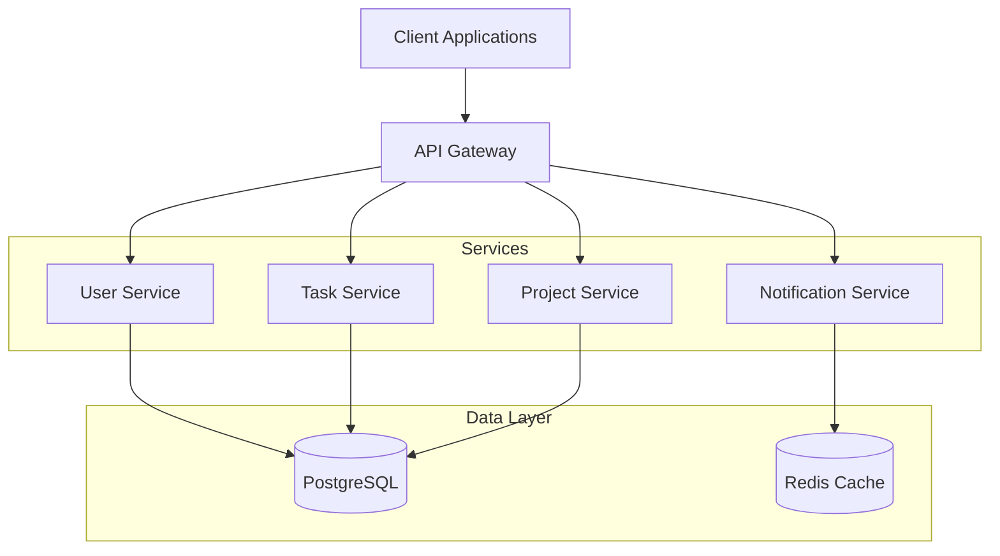
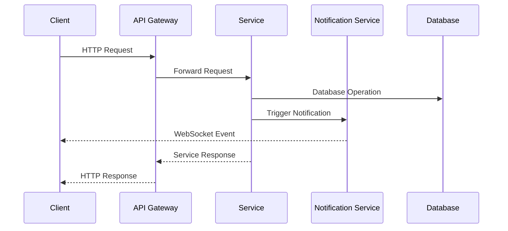
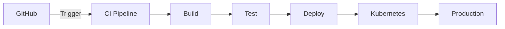

# Task Management System - Architecture Documentation

## Table of Contents
1. [Introduction](#introduction)
2. [High-Level Architecture](#high-level-architecture)
3. [Component Details](#component-details)
4. [Communication Patterns](#communication-patterns)
5. [Deployment Architecture](#deployment-architecture)
6. [Technical Decisions](#technical-decisions)

## Introduction
<!-- Requirement: System Architecture -->
This document outlines the architecture of the Task Management System, providing a comprehensive overview of its design, components, communication patterns, and technical decisions. The system is designed to be scalable, maintainable, and secure, following modern cloud-native principles.

## High-Level Architecture
<!-- Requirement: System Architecture -->

The system follows a microservices architecture with the following key components:
- API Gateway: Entry point for all client requests
- Core Services: User, Task, Project, and Notification services
- Data Layer: PostgreSQL for persistent storage and Redis for caching
- Infrastructure: AWS-based cloud infrastructure managed through Terraform

## Component Details
<!-- Requirement: Component Details -->

### API Gateway
- Primary entry point for all client requests
- Handles authentication and authorization
- Implements request routing and load balancing
- Provides API documentation and rate limiting

### Core Services
1. User Service
   - Manages user accounts and authentication
   - Handles role-based access control
   - Provides user profile management

2. Task Service
   - Manages task creation and lifecycle
   - Handles task assignments and status updates
   - Provides task search and filtering

3. Project Service
   - Manages project creation and configuration
   - Handles project team management
   - Provides project analytics and reporting

4. Notification Service
   - Handles real-time notifications via WebSocket
   - Manages email notifications
   - Provides notification preferences management

### Data Storage
1. PostgreSQL Database
   - Primary data store for all services
   - Handles transactional data
   - Maintains data relationships and integrity

2. Redis Cache
   - Session management
   - Real-time notification queues
   - Temporary data caching

## Communication Patterns
<!-- Requirement: Communication Patterns -->

### Synchronous Communication
1. REST APIs
   - Service-to-service communication
   - Client-to-gateway communication
   - Standard HTTP methods and status codes

2. WebSocket
   - Real-time notifications
   - Live updates for task changes
   - Client-side event streaming

### Asynchronous Communication
1. Event-Driven Messaging
   - Service-to-service events
   - Background job processing
   - Notification delivery

## Deployment Architecture
<!-- Requirement: Deployment Architecture -->

### Infrastructure Components
1. Kubernetes Cluster (EKS)
   - Manages containerized services
   - Handles service scaling
   - Provides service discovery

2. AWS Services
   - RDS for PostgreSQL
   - ElastiCache for Redis
   - S3 for file storage
   - CloudWatch for monitoring

### CI/CD Pipeline
1. Build Stage
   - Code compilation
   - Unit testing
   - Docker image creation

2. Test Stage
   - Integration testing
   - Security scanning
   - Performance testing

3. Deployment Stage
   - Infrastructure updates
   - Service deployment
   - Health checks

## Technical Decisions

### Technology Stack
1. Backend Services
   - Node.js with TypeScript
   - Express.js framework
   - Jest for testing

2. Data Storage
   - PostgreSQL for persistence
   - Redis for caching
   - S3 for file storage

3. Infrastructure
   - Kubernetes for orchestration
   - Terraform for IaC
   - AWS for cloud services

### Security Measures
1. Authentication
   - JWT-based authentication
   - Role-based access control
   - Secure session management

2. Network Security
   - VPC configuration
   - Security groups
   - TLS encryption

3. Monitoring
   - Centralized logging
   - Performance metrics
   - Error tracking

### Scalability Considerations
1. Horizontal Scaling
   - Kubernetes auto-scaling
   - Database read replicas
   - Cache clustering

2. Performance Optimization
   - Response caching
   - Connection pooling
   - Query optimization

3. High Availability
   - Multi-AZ deployment
   - Service redundancy
   - Automated failover